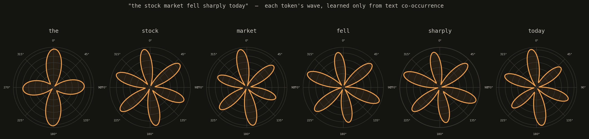
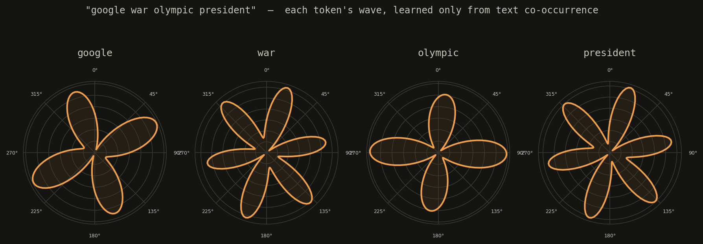
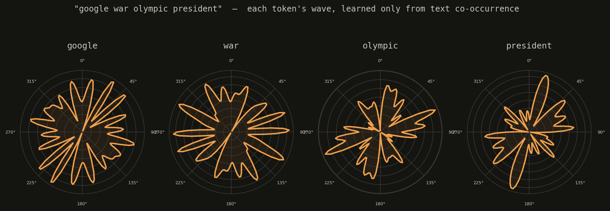
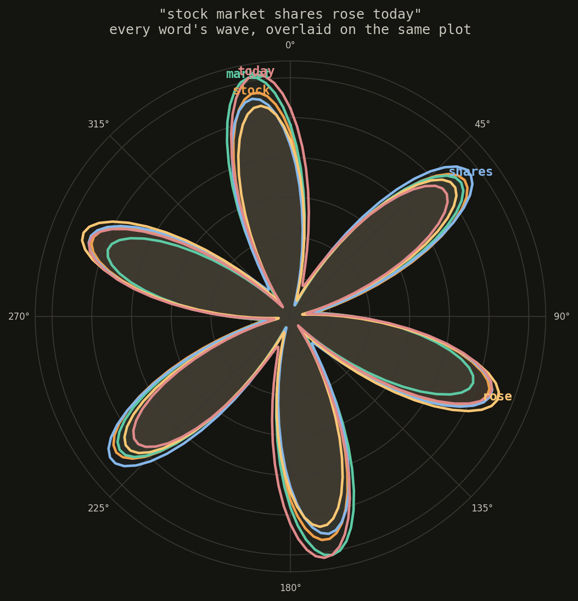
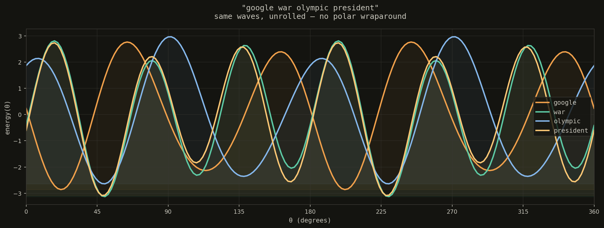

# wavembed

A word embedding whose representation is a **wave**, not a vector.

Same training objective as word2vec — skip-gram with negative sampling,
learned purely from real text co-occurrence, no labels, no categories.
The difference is what each word actually *is*: instead of a point in an
abstract N-dimensional space, a word is 3 (amplitude, phase) pairs — one
per even harmonic order (2, 4, 6) — that a fixed formula turns into a
periodic function of angle:

```
energy(θ) = exp( Σ amplitude_k · cos(order_k · θ − phase_k) )
```

That function is literally drawable: plotted in polar coordinates, each
word becomes a distinctive "flower" shape. Two related words end up with
visibly similar shapes, because they're trained to.

<p align="center"></p>

Unrelated words, by contrast, end up with visibly distinct shapes — no
two of these four share a lobe count or orientation:

<p align="center"></p>

Same four words, same training, but with 24 numbers instead of 6 (12
harmonics instead of 3) — more harmonics means sharper separation between
words (see the [benchmark](#benchmark-wordsim-353--simlex-999-vs-a-real-word2vec-on-the-same-corpus)
below), at the cost of a busier, spikier shape that's harder to read at a
glance:

<p align="center"></p>

A whole sentence at once, same idea: every word's wave drawn on the same
polar plot, each in its own color. Words from the same topic land as
near-identical, overlapping petals; the odd one out stands apart:

<p align="center"></p>

Same function, unrolled: angle on the x-axis instead of wrapped around a
circle. No new information over the polar view — just easier to read the
raw shape and compare peaks side by side:

<p align="center"></p>

## Why even harmonics, specifically

An even-order term satisfies `f(θ + π) = f(θ)` — the shape is symmetric
under inversion. That guarantees the wave's center of mass never moves,
no matter what the training finds: a word's identity is carried entirely
by *the shape* (which directions it bulges toward), never by a position.
This is what makes every word directly comparable and drawable on the
same footing.

## Why this beats plain cosine similarity for comparison

Harmonics of different orders are **orthogonal** over a full period.
That means the correlation between two words' waves has an exact closed
form — no numerical integration needed. Convert each harmonic's
`(amplitude, phase)` into Cartesian coordinates
`(amplitude·cos(phase), amplitude·sin(phase))` (call this the *phasor*
representation), and the dot product of two words' phasor vectors **is**
their wave correlation. `model.py`'s `similarity()` does exactly this.

## Why wave, not vector, at all

- **Sum = interference, for free.** Adding two vectors is just
  arithmetic — it doesn't know if they agree. Adding two waves produces
  constructive or destructive interference automatically, by the physics
  of the sum. Agreement is built into the operation, not computed after
  the fact.
- **Independent channels by frequency.** Each harmonic order is
  orthogonal to the others — you can read or inject information at one
  frequency without touching the rest, like frequency-division
  multiplexing. A matrix has no such separation unless you engineer block
  structure by hand.
- **Physically realizable outside digital silicon.** Wave addition is
  physical superposition — optical, acoustic, RF interference happens
  passively, at the speed of light, no multiply-accumulate required. This
  is a real door into analog/optical/neuromorphic computing that matrix
  multiplication doesn't open without converting everything back to
  digital multiply-adds.
- **Multiplying (not just summing) waves shifts frequency.** That's a
  second, different composition operator — closer to *binding* two
  concepts (AM/FM-style modulation) than to *blending* them (a weighted
  average). A matrix only has one natural combination operator (weighted
  sum); a wave has two, with different meanings.

**Subtraction makes the interference argument concrete.** Subtracting one
word's wave from another's isolates what's left after their shared shape
cancels out — and how much survives tracks correlation directly:

| pair | correlation | amplitude of A − B |
|---|---|---|
| `stock` − `market` (near-identical) | 0.988 | **20%** of either original — most of the shape cancels |
| `google` − `war` (unrelated, slightly anti-correlated) | -0.241 | **181%** of either original — nothing cancels, it reinforces instead |

This isn't tuned to look nice — it's a direct consequence of subtracting
two functions built from the same orthogonal basis: the more two waves
agree, the more they cancel when subtracted; the more they disagree
(especially when negatively correlated), the more the difference grows
past either input alone.

## Results

Trained on 60k real AG News headlines (~15.8M skip-gram pairs), 8000-word
vocabulary, 25 epochs. Word pairs, wave correlation:

| pair | similarity |
|---|---|
| `stock` ↔ `shares` | **0.994** |
| `team` ↔ `championship` | **0.987** |
| `google` ↔ `microsoft` | **0.981** |
| `google` ↔ `yahoo` | **0.990** |
| `microsoft` ↔ `software` | **0.995** |
| `google` ↔ `war` (unrelated) | **-0.241** |
| `stock` ↔ `olympic` (unrelated) | **-0.133** |
| `president` ↔ `basketball` (unrelated) | **0.030** |

Every related pair lands strongly positive; every unrelated pair lands
near zero or negative. First attempt (higher learning rate, fewer epochs)
partially collapsed — some unrelated pairs spiked to spuriously high
similarity because training got stuck early. Lowering the learning rate
and training longer fixed it; see `train.py`'s defaults.

## Benchmark: WordSim-353 / SimLex-999, vs a real word2vec on the same corpus

Spot-checked word pairs are convincing but cherry-picked. To get a real
number, both models were evaluated on the standard word-similarity
benchmarks — human-rated word pairs (`car`/`automobile` high,
`car`/`banana` low), scored by Spearman correlation between the model's
similarity and the human rating (`wavembed/benchmark.py`).

Both models were trained on **the same corpus** (text8, ~15.3M tokens of
Wikipedia text — the classic word2vec benchmark corpus), **the same
vocabulary size** (30k words), **the same window** (5), **the same
epochs** (8). Literature numbers for word2vec (0.6-0.7 on WordSim-353)
come from training on ~100 **billion** words of Google News — using them
as the baseline would have been comparing representations, not just
data. `wavembed/word2vec_baseline.py` trains the real thing on our exact
data instead, so any gap is about the representation (wave vs vector),
not about who saw more text.

The comparison is by **total trainable numbers per word**, not by the
label each library calls "dimensions" — word2vec (skip-gram, negative
sampling) trains *two* matrices per word, an input vector and a context
vector, and only exposes the input one as "the embedding"; a "24-dim"
word2vec model is actually training 48 numbers/word. `wavembed` trains
**one** table, used for both the target and context role during
training (see `train.py`'s `model.similarity(t_ids, c_ids)` — same
`params` tensor indexed both times). So the fair row-to-row match is
wavembed's *N* numbers against word2vec's *N/2*-dim vectors:

| numbers/word | SimLex-999 (w2v / wave) | WordSim-353 sim (w2v / wave) | WordSim-353 rel (w2v / wave) |
|---|---|---|---|
| 6  | 0.060 / **0.081** | **0.434** / 0.210 | **0.272** / 0.077 |
| 12 | **0.091** / 0.080 | **0.551** / 0.502 | 0.300 / **0.342** |
| 24 | 0.113 / **0.133** | 0.613 / **0.641** | 0.460 / **0.485** |
| 48 | 0.151 / **0.154** | 0.680 / **0.723** | 0.548 / **0.640** |

At very low capacity (6 numbers), word2vec's dedicated vector wins on
WordSim — a plain vector is simply more efficient when there's almost no
room to work with. But wavembed closes the gap fast: from 24
numbers/word onward it **wins on WordSim-353** (both similarity and
relatedness), using half the trainable numbers word2vec needs for the
same total budget, precisely because it doesn't need a second matrix for
the context role. SimLex-999 — the harder, synonymy-only benchmark — is
close throughout, with wavembed ahead at 3 of the 4 capacities tested (it
trails narrowly only at 12 numbers/word).

This is the honest version of the original question: swapping a vector
for a wave does *not* come for free at tiny capacity, but it stops
costing anything by ~24 numbers/word and turns into a real advantage
past that point, structurally, not by luck of the training run.

```bash
# reproduce this table
python -m wavembed.train --corpus text8 --vocab-size 30000 --window 5 --epochs 8 --orders "2,4,6,8,10,12" --save checkpoints/wavembed_text8_12.pt
python -m wavembed.benchmark --checkpoint checkpoints/wavembed_text8_12.pt
python -m wavembed.word2vec_baseline --dims 6,12,24,48
```

## Usage

```bash
pip install -r requirements.txt

# train from scratch (downloads AG News via Hugging Face `datasets`)
python -m wavembed.train

# check similarity between word pairs
python -m wavembed.similarity

# draw each token of a sentence as its own wave
python -m wavembed.visualize --sentence "the stock market fell sharply today"

# overlay every word of a sentence on the same polar plot, one color each
python -m wavembed.sentence --sentence "stock market shares rose today"

# same idea, unrolled onto a plain x/y plot instead of polar
python -m wavembed.unrolled --sentence "google war olympic president"
```

For your own corpus instead of AG News, use `corpus.build_corpus_from_texts(texts)`.

## Interactive demos

Both pages recompute the exact same harmonic formula in JavaScript, in
the browser, over the real trained weights — no backend, just a model
file fetched as JSON. A dropdown in each page switches between every
trained checkpoint (6/12/24 numbers per word, AG News or text8) live, so
you can feel the capacity trade-off from
["why wave, not vector, at all"](#why-wave-not-vector-at-all) yourself:
more numbers means sharper separation between words but a busier,
harder-to-read shape.

- `web/wave_tokenizer.html` — type a sentence and watch it split into
  tokens, each one its own live wave, in polar or unrolled-horizontal
  view.
- `web/wave_calculator.html` — pick two words and watch the four basic
  operations act on their waves: **sum** (interference — agreement
  reinforces, disagreement cancels), **difference** (isolates what's in A
  but not B — two nearly-identical words like `stock`/`market` collapse
  to a residual only ~20% the size of either original), **product**
  (frequency mixing), **quotient** (spikes visibly wherever B is near
  zero).

Because the model data is fetched rather than embedded, opening the HTML
file directly (`file://`) won't load it in most browsers — serve the
`web/` folder over http instead:

```bash
python -m http.server 8000 --directory web
# then open http://localhost:8000/wave_tokenizer.html
```

Regenerate every model's data + the dropdown's manifest with:

```bash
python -m wavembed.export_json --all
```

## Related work — where this fits

word2vec (2013) is old. This project doesn't pretend otherwise, and isn't
trying to compete with what's actually used in production today:

- **word2vec (2013) / GloVe (2014)** — static embeddings: one fixed vector
  per word, regardless of context. This is the era `wavembed` borrows its
  training objective from (skip-gram + negative sampling).
- **fastText (2016)** — same static idea, extended with subword
  (character n-gram) information, better on rare/unseen words.
- **ELMo (2018) → BERT and successors** — the real shift: *contextual*
  embeddings. The same word gets a different vector depending on the
  sentence it's in ("bank" of a river vs. a "bank" account), computed by
  a Transformer rather than looked up in a fixed table.
- **Today** — production-grade text embeddings (OpenAI/Cohere/Google
  embedding APIs, open models like E5, BGE, GTE) are built on large
  pretrained Transformers, contextual, hundreds to thousands of
  dimensions, trained on web-scale data with contrastive objectives far
  more sophisticated than plain negative sampling.

`wavembed` sits deliberately outside that progression. It isn't a step
toward beating E5 or BGE — 6 numbers per word, a single small corpus, and
no context-sensitivity couldn't plausibly compete on raw quality with
models trained on billions of tokens. The actual question being tested is
orthogonal to "which embedding is best today": **does swapping the
*representation* of a classical, well-understood objective (skip-gram)
from an arbitrary vector to a physically interpretable wave preserve the
useful properties of embeddings (real relational structure, meaningful
similarity, analogy) while adding new ones (drawability, exact
closed-form correlation, physical/analog realizability)?** word2vec is
used here as a controlled, minimal, easy-to-reason-about baseline for
that question — not as a target to surpass.

## Status

Validated against a real, matched-budget word2vec baseline (see the
[benchmark](#benchmark-wordsim-353--simlex-999-vs-a-real-word2vec-on-the-same-corpus)
above) rather than spot-checked word pairs alone: trained on two corpora
(AG News, text8), 30k-word vocabulary, capacity swept from 6 to 48
numbers/word. wavembed trails a same-budget word2vec at very low capacity
(6 numbers) but overtakes it on WordSim-353 from 24 numbers/word onward,
using half the trainable numbers per word word2vec needs for the same
budget (one shared table vs. word2vec's separate input/context
matrices). Known open questions: whether the trend keeps climbing past
48 numbers/word or saturates, behavior at vocabularies beyond 30k,
performance on other standard benchmarks (e.g. word analogy), and the
context-sensitivity gap noted in "Related work" above.
